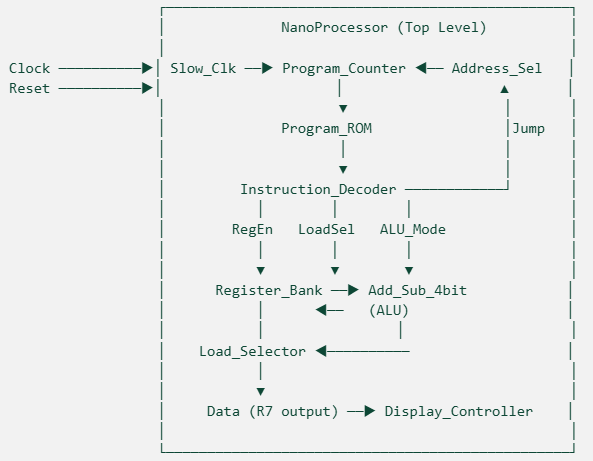
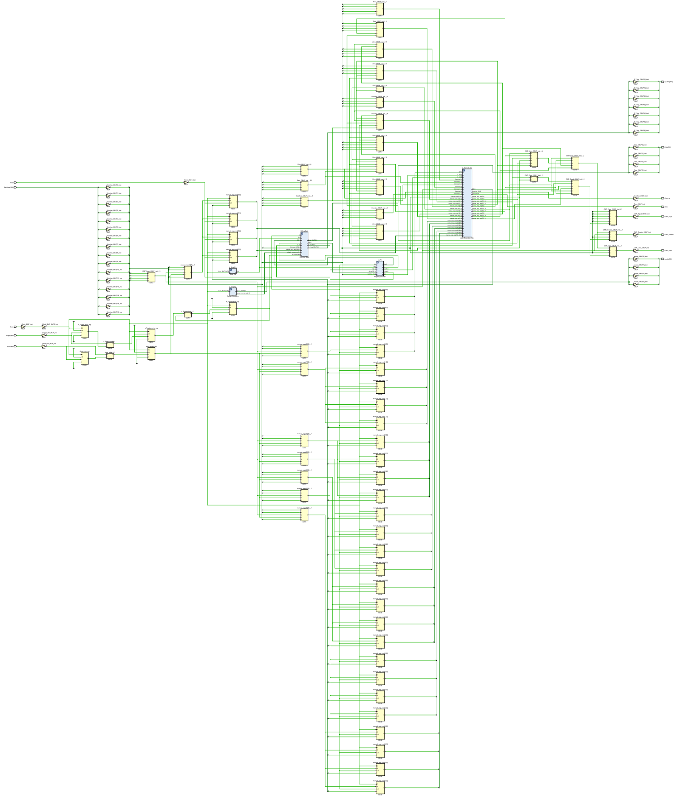
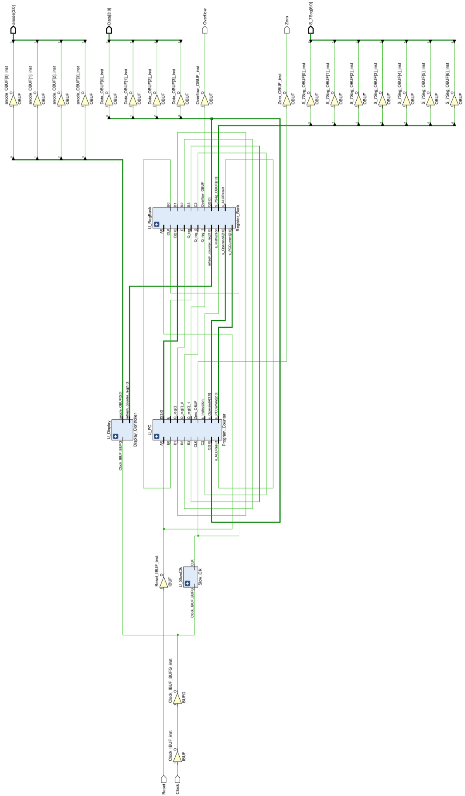

# NanoProcessor Documentation & Technical Assets

<p>
  
  
  
  
  
</p>

Comprehensive technical documentation, academic reports, opcode reference manuals, architectural schematics, and simulation waveforms for the 4-bit NanoProcessor FPGA design.

> [!TIP]
> The synthesizable VHDL source code, testbenches, Vivado constraints, and pre-compiled bitstreams are hosted in the **[nano-processor](https://github.com/WCSS-nano-processor/nano-processor)** repository.

---

## Documentation Library

| Document | Description | Format | Direct Link |
|---|---|:---:|:---:|
| **Comprehensive Technical Report** | 113-page final report detailing architecture, module design, truth tables, ISA, RTL schematics, simulation waveforms, and Basys 3 FPGA synthesis. | PDF | [Download PDF](reports/WCSS%20-%20Nano-Processor.pdf) |
| **12-bit Machine Code Manual** | Base NanoProcessor opcode guide, instruction format, register layout, and program memory address map. | PDF | [Download PDF](manuals/NanoProcessor_Basic_Manual.pdf) |
| **14-bit Extended ISA Manual** | Complete 14-bit instruction set reference, arithmetic and logic operations, status flags, and manual execution mode guide. | PDF | [Download PDF](manuals/NanoProcessor_Extended_Manual.pdf) |

---

## Architectural Highlights

### Base NanoProcessor Block Diagram
The processor follows a single-cycle Harvard-style microarchitecture with a dedicated instruction ROM and 4-bit datapath.



### Extended 14-bit NanoProcessor Architecture
The 14-bit design introduces an expanded instruction word, 12 ALU operations, hardware flag status registers (Zero, Carry, Overflow, Negative, CMP), an input selector, and dual-mode manual stepping.



### Vivado Elaborated RTL Schematic
Synthesized logic representation generated in Xilinx Vivado for the Digilent Basys 3 FPGA.



---

## Report Structure (113 Pages)

The full technical report in [`reports/WCSS - Nano-Processor.pdf`](reports/WCSS%20-%20Nano-Processor.pdf) is organized into eight parts:

1. **Part 1 — Introduction & Objectives**: Educational background, microprocessor objectives, tools and environment, team organization, and report structure.
2. **Part 2 — System Architecture**: Architectural philosophy, top-level datapath, clock architecture (100 MHz division to 1 Hz), bus structure, `R0` zero-register convention, and Basys 3 hardware pin mappings.
3. **Part 3 — Component Design & Implementation**: Gate-level and RTL design for Full Adder (`FA`), D Flip-Flop (`D_FF`), 4-bit Ripple Carry Adder (`RCA_4`), 4-bit Register (`Reg`), 3-to-8 Decoder, 2-Way Multiplexers, 8-Way Multiplexer, Add/Sub unit, Program Counter, PC Adder, Address Selector, Load Selector, Program ROM, and 7-Segment Display Controller.
4. **Part 4 — Instruction Set Architecture (ISA)**: 12-bit Base ISA specification (`MOVI`, `ADD`, `NEG`, `JZR`), bit-field definitions, register allocation, and machine code translation.
5. **Part 5 — Simulation & Verification**: Unit testbench waveforms for all components and top-level integration verification.
6. **Part 6 — Extended NanoProcessor (14-bit)**: Extended ALU (`ALU_Extended_14bit`), multi-function instruction decoder, multiplier logic, bitwise operators, comparison unit, manual execution controller, and Vivado synthesis results.
7. **Part 7 — Conclusion & Reflection**: FPGA resource utilization, maximum clock frequency, timing closure, challenges resolved, and future architectural enhancements.
8. **Part 8 — Appendix**: Detailed machine code tables, team member contributions, and supplementary waveform figures.

---

## Asset Directory Structure

```
nano-processor-docs/
├── reports/
│   └── WCSS - Nano-Processor.pdf          # 113-page academic report
│
├── manuals/
│   ├── NanoProcessor_Basic_Manual.pdf     # 12-bit ISA cheat-sheet
│   └── NanoProcessor_Extended_Manual.pdf  # 14-bit ISA & flags guide
│
├── assets/images/
│   ├── architecture/                      # 8 Architecture and datapath diagrams
│   │   ├── 01_basic_top_level_block_diagram.png
│   │   ├── 02_clock_architecture.png
│   │   ├── 03_datapath_timing.png
│   │   ├── 04_design_hierarchy.png
│   │   ├── 05_instruction_format_12bit.png
│   │   ├── 06_isa_design.png
│   │   ├── 07_register_state_elements.png
│   │   └── 08_extended_14bit_block_diagram.png
│   │
│   ├── schematics/                        # 7 Elaborated Vivado RTL & circuit schematics
│   │   ├── 01_rca_4_adder_schematic.png
│   │   ├── 02_program_rom_schematic.png
│   │   ├── 03_basic_nanoprocessor_vivado_rtl.png
│   │   ├── 04_instruction_decoder_14bit_rtl_part1.png
│   │   ├── 05_instruction_decoder_14bit_rtl_part2.png
│   │   ├── 06_top_nanoprocessor_14bit_rtl_part1.png
│   │   └── 07_top_nanoprocessor_14bit_rtl_part2.png
│   │
│   └── waveforms/                         # 24 Simulation waveform captures
│       ├── 01_tb_fa_full_adder.png
│       ├── 02_tb_rca_4_ripple_carry_adder.png
│       ├── 03_tb_add_sub_4bit.png
│       ├── 04_tb_reg_register.png
│       ├── 05_tb_program_counter.png
│       ├── 06_tb_pc_adder.png
│       ├── 07_tb_mux_2way_3bit.png
│       ├── 08_tb_mux_8way_4bit.png
│       ├── 09_tb_decoder_3to8.png
│       ├── 10_tb_mux_2way_4bit.png
│       ├── 11_tb_register_bank.png
│       ├── 12_tb_program_rom.png
│       ├── 13_tb_address_selector.png
│       ├── 14_tb_display_controller.png
│       ├── 15_tb_lut_16_7.png
│       ├── 16_tb_nanoprocessor_basic_waveform_1.png
│       ├── 17_tb_nanoprocessor_basic_waveform_2.png
│       ├── 18_tb_nanoprocessor_basic_waveform_3.png
│       ├── 19_tb_input_selector.png
│       ├── 20_tb_alu_extended_14bit.png
│       ├── 21_tb_top_nanoprocessor_14bit_waveform_1.png
│       ├── 22_tb_top_nanoprocessor_14bit_waveform_2.png
│       ├── 23_tb_program_rom_14bit.png
│       └── 24_tb_manual_controller.png
│
└── README.md
```

---

## Team & Credits

Developed for **CS1050: Computer Organisation & Digital Design** at the **Department of Computer Science & Engineering, University of Moratuwa**.

**Team WCSS**:
- Bandaranayake I.B.W.D
- Botheju P.V.C.N.P
- Dayarathna A.M.S.T
- Bandara W.B.S.N

---

## License

This documentation and associated assets are licensed under the [MIT License](LICENSE).
